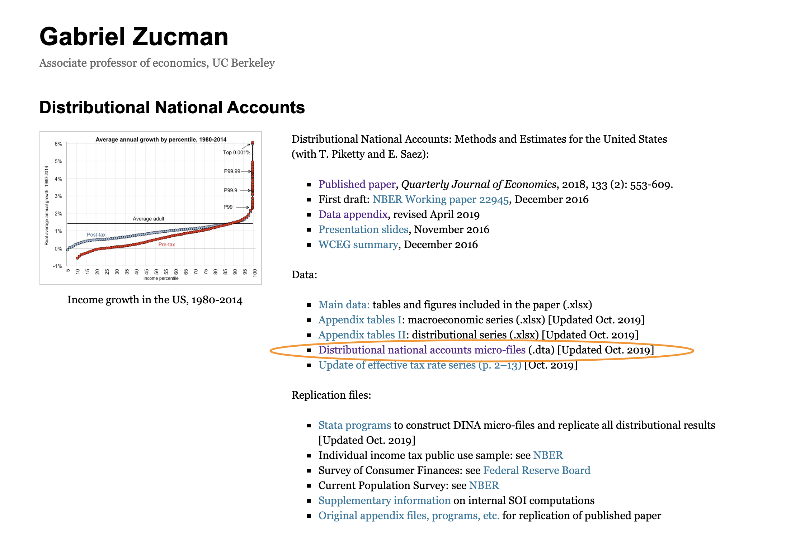
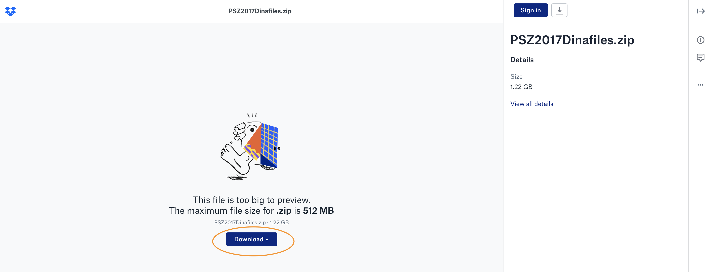
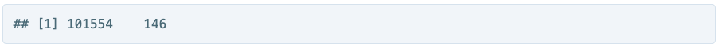
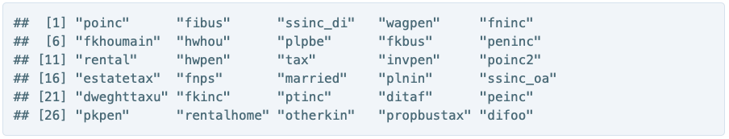

```{r setup, include=FALSE}
knitr::opts_chunk$set(echo = TRUE)
knitr::opts_chunk$set(tidy = TRUE)
knitr::opts_chunk$set(message = FALSE)
knitr::opts_chunk$set(warning = FALSE)
```

##In this post you will:
* Download the micro-files used in downstream analysis 
* Load a subset of the files  
* Look at the variable names  

### Locating files on web  
The micro-files are currently located in Gabriel Zucman's Distributional National Accounts page located [here](http://gabriel-zucman.eu/usdina/). 
  

After clicking on the circled link you will be able to download a zip file of all of the current yearly files.  There will probably be a new set released every year and the zip file may change over time.
  

Unzip the source files to a folder that you can get to through R.  I have mine in a sub-directory of the main R project.  

Create a new folder at the same level as the folder you unzipped to called `Dina_subset`.  You can change the code you'll see later if you want a different folder structure. 

These files are large, every year has almost 69,000 records which represents a generic US individual-type.  For instance one record could be for a married working man age 20-64 with x amount of income from various sources, and y amount of wealth.  

##Finally some code  
We will use these libraries in this section  
```{r}
library(tidyverse)
library(fs)
library(haven)
```

###Get the filenames in Dina_subset  
This uses the `fs` package's `dir_ls()` function. I have the 1968 & 2018 years in the subset folder.  
```{r eval=FALSE}
files <- dir_ls("Data/Dina_subset/") 
files
```


### Import the files into a single dataframe  
This part does a lot in two lines of code.  It maps the filenames to the `haven` package's `read_dta()` function which imports native-Stata data files.  It also appends the filename to a column called `id`, then extracts the year from the filename and puts it into another column.  
```{r eval=FALSE}
dina_df <- map_dfr(files, ~ read_dta(.x), .id = "filename") %>%
  extract(filename, "year", "(\\d{4})")
dim(dina_df)
```


There are 146 variables per record.

###Look at the variable names  
This is what we're going to deal with next.  
```{r eval=FALSE}
sample(names(dina_df), 30, replace = FALSE)
```

##Next up:  Renaming the variables  

###END
